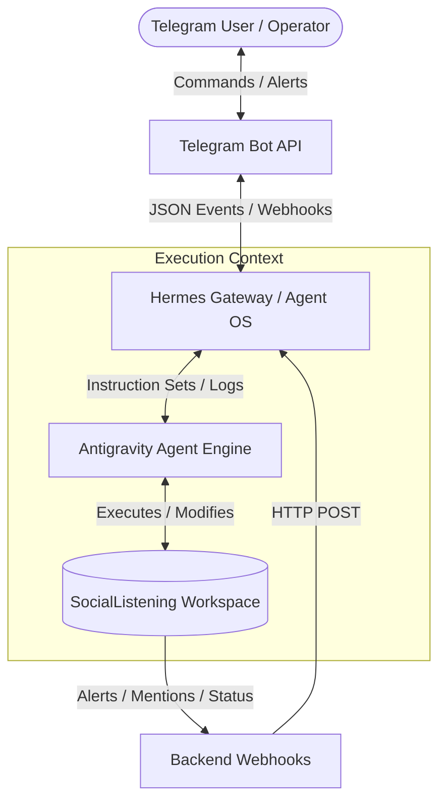
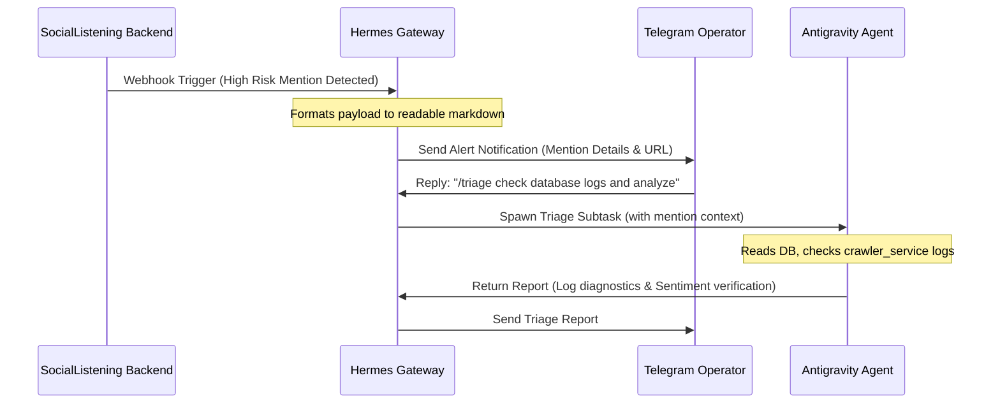

# Telegram -> Hermes -> Antigravity Workflow Guide

This document describes the remote management, notification, and automation workflow for the SocialListening project using **Telegram** (User/Operator Interface), **Hermes** (Agent Gateway and Orchestrator), and **Antigravity** (Autonomous Agent Execution Engine).

---

## 1. High-Level Architecture

The integration leverages a three-tier setup that bridges remote human operators to the local project workspace and runtime.



---

## 2. Component Directory & Roles

### 2.1 Telegram Command Center (UI)
*   **Role**: Serves as the operator's primary control and feedback loop.
*   **Key Inputs**:
    *   **Slash Commands**: `/scan` (trigger crawling), `/status` (check health), `/triage` (analyze alert severity), `/report` (generate reports).
    *   **Natural Language Queries**: e.g., *"Show me recent negative mentions about brand X"* or *"Check why the backend crawl job failed"*.
*   **Key Outputs**:
    *   Real-time notifications for critical alert events (High-Risk Mentions, Server Errors).
    *   File download links (PDF analytics reports, Excel sheets, export logs).
    *   Process execution feedback and code pull request confirmations.

### 2.2 Hermes Orchestration Layer
*   **Role**: The state and context manager. It coordinates conversations, schedules, and bridges communication.
*   **Responsibilities**:
    *   **Webhook Routing**: Listens to HTTP payloads sent by the SocialListening backend (via the `NotificationDeliveryLog` triggers).
    *   **Intent Resolution**: Parses incoming Telegram text/messages to determine if a task should be handled by a rule, a custom script, or delegated to the Antigravity agent.
    *   **Context & State Preservation**: Keeps trace of the conversation history (stored in memory/session maps) to handle multi-turn operations.
    *   **Payload Formatting**: Prepares raw text updates or structured rich messages (using Telegram markdown or HTML parse modes) for the operator.

### 2.3 Antigravity Autonomous Executor
*   **Role**: The hands-on worker inside the SocialListening workspace (at `/home/tth-nguyenhung/agent/projects/SocialListening`).
*   **Responsibilities**:
    *   **Workspace Interaction**: Accesses the filesystem to read files, examine git history, or review Celery task logs.
    *   **Task Execution**: Runs local diagnostic tools, databases scripts (e.g., `check_db.py`), or compilation checks (`python -m compileall backend/app`).
    *   **Code Correction**: Autonomously writes bug fixes, updates configuration defaults, updates frontend UI code (using TypeScript/Next.js/Axios), and tests them.
    *   **Git Operations**: Switches branches, pulls latest changes from `main`, commits changes, pushes feature branches to remote repositories, and triggers GitHub PR creation.

---

## 3. Core Interaction Workflows

### Workflow A: Real-Time Incident Alerting & Triage



1.  **Detection**: The SocialListening crawler identifies a negative mention exceeding the risk threshold.
2.  **Notification Dispatch**: The Celery worker (`app.workers.tasks`) calls `notification_service` to send a Webhook.
3.  **Hermes Interception**: Hermes receives the webhook, generates a rich card summary, and broadcasts it to the registered Telegram Chat ID.
4.  **Operator Directive**: The admin replies directly to the alert message on Telegram, requesting a diagnostic run.
5.  **Agent Invocation**: Hermes dispatches the workspace path and context to **Antigravity**.
6.  **Inspection**: Antigravity runs test suites and checks database records, returning the findings to Hermes to be delivered to Telegram.

---

### Workflow B: Remote Task Activation (e.g., Manual Scan)

1.  **Command**: The operator sends `/scan --keywords "security breach"` to the Telegram Bot.
2.  **Parsing**: Hermes identifies the `/scan` command and verifies the user's role.
3.  **Trigger**: Hermes communicates with the SocialListening API or instructs Antigravity to run a background crawler job using:
    ```bash
    python backend/app/scripts/run_crawler_manual.py --query "security breach"
    ```
4.  **Reporting**: Once execution completes, Antigravity extracts the summary statistics from the run and passes them back to Hermes. Hermes outputs the final result (e.g., *"Crawl completed. 14 new mentions added to DB"*).

---

### Workflow C: Autonomous Diagnostics and Code Repair

1.  **Error Event**: A critical exception occurs during PDF generation (`app/services/pdf_generator.py`) in production.
2.  **Relay**: Hermes registers the exception payload via the system's log-monitoring webhook.
3.  **Delegation**: Hermes initiates a patch request with Antigravity.
4.  **Agent Repair Cycle**:
    *   Antigravity creates a new Git feature branch: `fix/pdf-generator-crash`.
    *   Antigravity inspects `pdf_generator.py` and the exception traceback.
    *   Antigravity implements a defensive block, resolving the type conflict.
    *   Antigravity verifies the fix by running:
        ```bash
        python -m compileall backend/app
        ```
    *   Antigravity commits the fix and pushes the branch to GitHub.
    *   Antigravity invokes a GitHub API command via Hermes to open a Pull Request (PR).
5.  **Operator Feedback**: Hermes posts a message on Telegram with the PR link and a brief summary of changes.

---

## 4. Setup and Configuration

To support this workflow, the following configurations are defined in the workspace:

### 4.1 System Environment Variables
Ensure the following variables are configured in the backend environment (`backend/.env`):

```env
# Telegram Gateway Configuration
TELEGRAM_BOT_TOKEN=your_bot_token_from_botfather
TELEGRAM_CHAT_ID=your_target_channel_or_user_id

# Webhook Integrations
WEBHOOK_NOTIFICATIONS_ENABLED=true
SYSTEM_WEBHOOK_URL=https://hermes-gateway.production/webhook/social-listening
```

### 4.2 Security Constraints
1.  **IP Filtering**: The Hermes webhook endpoint should only accept requests originating from trusted SocialListening production nodes (Vercel/Render).
2.  **Write Access Control**: Antigravity runs with limited write permissions. It can modify documents and project code files, but direct push to the protected `main` branch is disabled. All code deployments MUST proceed through a Pull Request code review.
3.  **Command Authorization**: Commands executed through the Telegram bot must require authentication or belong to authorized Chat IDs.

### 4.3 Natural Command Mode
The workflow currently supports **Hybrid Command Mode**:

*   **Slash commands** (`/scan`, `/status`, `/triage`, `/report`) are explicit, role-checked, and routed deterministically.
*   **Free-form messages** are accepted as natural language triggers only if they contain primary intent keywords or explicit action phrases that can be mapped to a known workflow.

**In scope (current behavior):**
*   Inline parameters in slash commands (e.g. `/scan --keywords "security breach"`).
*   Follow-up / context-rich replies on an active incident thread (e.g. *"check the crawler logs and summarise"* after a risk alert).

**Out of scope / not yet supported:**
*   Fully open-ended natural language without any recognizable command surface.
*   Implicit multi-step task planning that does not reference an existing workflow or artifact.

Operators should prefer explicit commands unless the conversation has already been narrowed to a specific incident or report scope.
